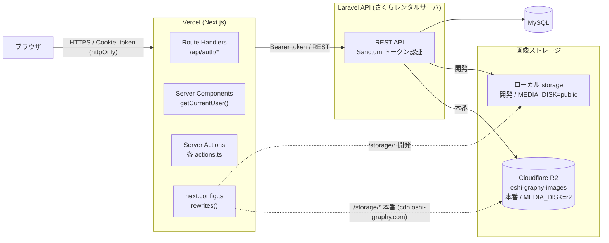

# Oshi Graphy (フロントエンド)


## アプリの概要
Oshi-Graphy（推しグラフィー）は、80〜90年代から今も活躍するアーティストの推し活を楽しむ**中高年世代を対象**にした推し活ダイアリー共有アプリです。

ライブ参戦や日常の推し活を日記として残し、同じ世代の仲間と共有・交流できる、落ち着いたクローズドな場を提供します。

本リポジトリは、Oshi-Graphyのフロントエンドです。バックエンドは Laravel 製の REST API として構築されています。

**【バックエンドリポジトリ】:** [https://github.com/ichitaka58/oshi-graphy](https://github.com/ichitaka58/oshi-graphy)

## 技術スタック

- [Next.js](https://nextjs.org/) 16 (App Router)
- [React](https://react.dev/) 19
- [TypeScript](https://www.typescriptlang.org/)
- [Tailwind CSS](https://tailwindcss.com/) 4
- [shadcn/ui](https://ui.shadcn.com/)（Radix UI ベース）
- [Base UI](https://base-ui.com/)（Combobox コンポーネントのみ）
- [React Hook Form](https://react-hook-form.com/) + [Zod](https://zod.dev/)
- [Vitest](https://vitest.dev/) + [Testing Library](https://testing-library.com/)（コンポーネントテスト）

## アーキテクチャ

フロントエンド（本リポジトリ、Vercel）とバックエンド（Laravel、さくらレンタルサーバ）が分離した構成。日記画像・ユーザーアイコンは Laravel から Cloudflare R2 に書き込まれ、Next.js は `next.config.ts` の rewrite で環境ごとに配信元を切り替える（開発 = Laravel ローカルディスク、本番 = R2 カスタムドメイン `cdn.oshi-graphy.com`）。



## 認証設計

- API 通信は Laravel Sanctum のトークン認証を使用。ログイン時に発行される `access_token` は Next.js の Route Handler (`src/app/api/auth/login`) がブラウザに公開せず、httpOnly Cookie（`token`）として保存する。
- ページ側では基本的に `getCurrentUser()`（`src/lib/auth.ts`）を使用し、未ログインなら `/login` にリダイレクトする。`getCurrentUserOrNull()` はヘッダーなど「ログイン状態によって表示を出し分けたいだけ」の箇所でのみ使う。
- **ホームページ（`/`）以外はすべてログイン必須。** `public-diaries` のような "public" という名前のルートも、未ログインでは閲覧できない。

## セットアップ

### 前提条件

- Node.js（`package.json` の `next@16` / `react@19` が動作するバージョン）
- Laravel バックエンド（[oshi-graphy](https://github.com/ichitaka58/oshi-graphy)）が起動していること

### インストール

```bash
npm install
```

### 環境変数

ルートに `.env.local` を作成し、Laravel バックエンドの URL を設定する。

```bash
LARAVEL_API_URL=http://localhost
```

`next.config.ts` の rewrites 設定により、アップロード画像（`/storage`）と Laravel 配信アセット（`/images`）は同一オリジン経由でプロキシされる。本番はアップロード画像の実体が Cloudflare R2（`R2_PUBLIC_URL`、Vercel側の環境変数で設定）だが、開発環境は `MEDIA_DISK=public` のままローカル保存されるため、`/storage` は開発環境のみ Laravel 側にプロキシされる（`R2_PUBLIC_URL` は開発環境では不要）。

### 本番環境

本番は [Vercel](https://vercel.com/) にデプロイされている。`LARAVEL_API_URL` などの環境変数は Vercel のプロジェクト設定で管理しており、本リポジトリには含まれない。

### 開発サーバーの起動

```bash
npm run dev
```

[http://localhost:3000](http://localhost:3000) でアプリにアクセスできる。

## スクリプト

| コマンド | 内容 |
| --- | --- |
| `npm run dev` | 開発サーバーを起動 |
| `npm run build` | 本番用ビルド |
| `npm run start` | 本番ビルドの起動 |
| `npm run lint` | ESLint によるコード検査 |
| `npm run test` | Vitest によるテストを実行（1回のみ） |
| `npm run test:watch` | Vitest をウォッチモードで実行 |

テストファイルはテスト対象のコンポーネントと同じディレクトリに `*.test.tsx` として配置する。

## ディレクトリ構成（`src/`）

```
src/
├── app/          # App Router（ページ・Route Handler・Server Actions）
│   ├── admin/          # アーティスト管理などの管理者向けページ
│   ├── api/auth/        # ログイン・登録・ログアウトの Route Handler
│   ├── artists/         # アーティスト一覧・詳細
│   ├── diaries/         # 日記の一覧・詳細・作成
│   ├── login / register # 認証ページ
│   ├── notifications/   # 通知
│   ├── public-diaries/  # 公開ダイアリー（ログイン必須）
│   ├── settings/        # アカウント設定
│   └── users/           # ユーザー詳細
├── components/   # 共通コンポーネント（ui/ は shadcn/ui ベース）
├── contexts/     # React Context（未読通知数など）
├── lib/          # 認証・日付処理・バリデーションスキーマなどの共通ロジック
└── types/        # ドメイン型定義（Diary, Artist, User など）
```
